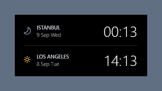
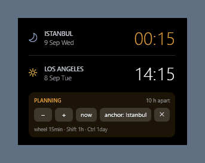

# Desktop Dual Clock

A transparent, always-on-desktop clock for Windows that shows **two cities side by
side** — plus a planning mode that converts a time you pick in one city into the
other.

No installer, no dependencies, no background service. It is a single PowerShell
script using WPF, which ships with Windows.

*[Türkçe belgeler: README.tr.md](README.tr.md)*



## Why

Scheduling a call across time zones usually means opening a converter, typing a
time, and mentally tracking whether the other side is already on the next day.
This widget keeps both clocks on your desktop, and when you need to plan, you
set a time in one city and read the answer in the other — including the date
shift, which is where most mistakes happen.

## Features

- **Two cities, 25 to choose from** — right-click → *Select city*
- **Planning mode** — pick a time in one city, see the other instantly
  (`−`/`+` 15 min, mouse wheel, Shift = 1 hour, Ctrl = 1 day)
- **Correct DST handling** — no fixed offsets; conversions use each city's own
  rules for the date in question, so the gap changes by itself across
  transitions
- **Day/night icon** per city and separate dates, so a next-day shift is obvious
- **Desktop-level** — never steals focus, never covers your work, stays below
  every window
- **Drag anywhere**, adjustable background opacity, position remembered



## Requirements

- Windows 10 or 11
- Windows PowerShell 5.1 (preinstalled — no need for PowerShell 7)

## Install

```powershell
git clone https://github.com/sefaguntepe/desktop-dual-clock.git
cd desktop-dual-clock
powershell -ExecutionPolicy Bypass -File kur-baslangic.ps1
```

`kur-baslangic.ps1` adds a shortcut to your user Startup folder so the clock
launches at sign-in. It touches nothing else — no registry keys, no system
settings.

To run it once without installing:

```powershell
powershell -NoProfile -ExecutionPolicy Bypass -STA -File saat.ps1
```

## Usage

Right-click the widget:

| Menu | What it does |
|---|---|
| *Background* | Transparent / light / dark backdrop |
| *Select city* | Choose the city for the top and bottom row |
| *Planning mode* | Toggle the time converter |
| *Reset position* | Move back to the top-right corner |
| *Close* | Quit |

**Planning mode.** One row is the *anchor* (highlighted amber). Change its time
and the other row follows.

| Control | Action |
|---|---|
| `−` / `+` | ∓15 minutes |
| Mouse wheel | 15 min — **Shift** 1 hour, **Ctrl** 1 day |
| `now` | Now, rounded up to the next 15 minutes |
| `anchor: …` | Swap which city is the anchor (the instant is preserved) |
| `✕` | Back to the live clock |

Planning mode is deliberately **not** persisted — it always starts as a live
clock, so a frozen time never looks like a broken widget.

## How it works

**Staying on the desktop.** The window is a normal top-level window with
`WS_EX_NOACTIVATE` (never takes focus) and `WS_EX_TOOLWINDOW` (hidden from
Alt+Tab). It is kept at the bottom of the z-order by handling
`WM_WINDOWPOSCHANGING` and rewriting `hwndInsertAfter` to `HWND_BOTTOM`.

That last detail matters: an earlier version pushed the window down with a
timer instead, which quietly broke the desktop — the right-click menu closed
itself and icon rubber-band selection kept getting cancelled. Watching the
event is correct; polling is not.

**Time conversion.** Never a fixed offset. Every conversion goes
local → UTC → target using `TimeZoneInfo`, so each city's DST rules apply for
the date being converted. Times that do not exist (the hour skipped when clocks
jump forward) are shifted an hour ahead instead of throwing.

**Configuration** lives in `%APPDATA%\MasaustuSaat\ayarlar.json`.

## Uninstall

```powershell
powershell -ExecutionPolicy Bypass -File kaldir-baslangic.ps1
```

Then close the widget from its right-click menu. To remove saved settings,
delete `%APPDATA%\MasaustuSaat`.

## Notes

- **Interface language follows Windows.** Turkish on a Turkish display language,
  English otherwise — no setting, no restart dance. Only `tr` and `en` are
  built in; adding another is a string table away.
- Because the window never takes keyboard focus, times cannot be typed — every
  control is mouse-driven by design. That focus trade-off is what lets it sit
  on the desktop without interrupting you.
- The mouse wheel needs Windows' *"Scroll inactive windows when I hover over
  them"* setting (on by default). The `−`/`+` buttons always work.

## License

MIT — see [LICENSE](LICENSE).
