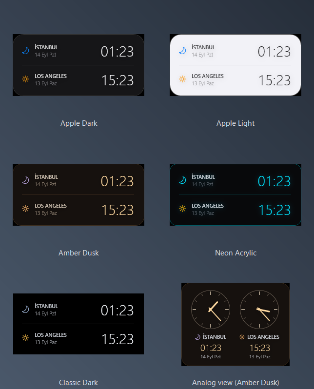



# Desktop Dual Clock

A transparent, always-on-desktop clock for Windows that shows **two cities side by
side** — plus a planning mode that converts a time you pick in one city into the
other.

No installer, no dependencies, no background service. It is a single PowerShell
script using WPF, which ships with Windows.

*[Türkçe belgeler: README.tr.md](README.tr.md)*


## Why

Scheduling a call across time zones usually means opening a converter, typing a
time, and mentally tracking whether the other side is already on the next day.
This widget keeps both clocks on your desktop, and when you need to plan, you
set a time in one city and read the answer in the other — including the date
shift, which is where most mistakes happen.

## Features

- **Two cities, 25 to choose from** — right-click → *Select city*
- **Planning mode** — pick a time in one city, see the other instantly
  (`−`/`+` 15 min, mouse wheel, Shift = 1 hour)
- **Correct DST handling** — no fixed offsets; conversions use each city's own
  rules for the date in question, so the gap changes by itself across
  transitions
- **Day/night icon** per city and separate dates, so a next-day shift is obvious
- **Six visual themes**, including one that follows the Windows light/dark
  setting automatically — right-click → *Theme / Style*
- **Digital or analog** — right-click → *View*. The analog dials take their
  colours from whichever theme is active, so the two settings compose
- **Desktop-level** — never steals focus, never covers your work, stays below
  every window
- **Drag anywhere**, adjustable background opacity, position remembered


## Themes and views

Every theme works in both views — *Theme / Style* sets the palette,
*View* sets the layout, and the two compose freely.



*Apple Auto* is not pictured because it has no palette of its own: it follows
the Windows light/dark setting and renders as Apple Dark or Apple Light.

## Requirements

- Windows 10 or 11
- Windows PowerShell 5.1 (preinstalled — no need for PowerShell 7)

## Install

```powershell
git clone https://github.com/sefaguntepe/desktop-dual-clock.git
cd desktop-dual-clock
powershell -ExecutionPolicy Bypass -File kur-baslangic.ps1
```

`kur-baslangic.ps1` creates **two** shortcuts named **Dual Clock**, both running
the same command: one in your user Startup folder so the clock launches at
sign-in, and one in the Start menu so you can reopen it after closing it. Add
`-Masaustune` for a desktop shortcut too. They carry the app icon
(`dual-clock.ico`). It touches nothing else — no registry keys, no system
settings.

Upgrading from an earlier version? The shortcuts used to be called *Masaustu
Saat*. Installing, uninstalling, or toggling *Start with Windows* removes the
old ones, so you never end up with two shortcuts both launching the clock.

**Closed the clock? Type "Dual Clock" in Start.**

You can also turn auto-start on or off later from the widget itself:
right-click -> *Start with Windows*. The tick reflects whether the Startup
shortcut actually exists, so it stays honest even if you run
`kur-baslangic.ps1` / `kaldir-baslangic.ps1` by hand.

Both shortcuts go through `conhost.exe` rather than calling `powershell.exe`
directly: when the default console host is Windows Terminal, `-WindowStyle
Hidden` does nothing and an empty terminal is left sitting behind the clock.
The script also hides and frees its own console at startup.

Only one copy runs at a time; launching it again exits quietly. Two copies
both wrote `ayarlar.json`, so position and city choices overwrote each other.

To run it once without installing:

```powershell
powershell -NoProfile -ExecutionPolicy Bypass -STA -File saat.ps1
```

## Usage

Right-click the widget:

| Menu | What it does |
|---|---|
| *Theme / Style* | Apple Auto (follows the Windows light/dark setting), Apple Dark, Apple Light, Amber Dusk, Neon Acrylic, Classic Dark |
| *View* | Digital rows, or two analog dials side by side |
| *Background* | Transparent / light / dark backdrop |
| *Select city* | Choose the city for the top and bottom row |
| *Planning mode* | Toggle the time converter |
| *Start with Windows* | Toggle the Startup-folder shortcut on or off |
| *Reset position* | Move back to the top-right corner |
| *Close* | Quit |

**Planning mode.** The **top row is the one you set** (highlighted). Change its
time and the bottom row follows. To plan in the other city's time instead, swap
the two cities from *Select city*.

| Control | Action |
|---|---|
| `−` / `+` | ∓15 minutes |
| Mouse wheel | 15 min — **Shift** 1 hour |
| `now` | Now, rounded up to the next 15 minutes |
| `✕` | Back to the live clock |

Planning mode is deliberately **not** persisted — it always starts as a live
clock, so a frozen time never looks like a broken widget.

## How it works

**Staying on the desktop.** The window is a normal top-level window with
`WS_EX_NOACTIVATE` (never takes focus) and `WS_EX_TOOLWINDOW` (hidden from
Alt+Tab). It is kept at the bottom of the z-order by handling
`WM_WINDOWPOSCHANGING` and rewriting `hwndInsertAfter` to `HWND_BOTTOM`.

That last detail matters: an earlier version pushed the window down with a
timer instead, which quietly broke the desktop — the right-click menu closed
itself and icon rubber-band selection kept getting cancelled. Watching the
event is correct; polling is not.

**Time conversion.** Never a fixed offset. Both rows are rendered from one
UTC instant through `TimeZoneInfo`, so each city's own DST rules apply for the
date in question.

Planning mode stores that instant **as UTC**, not as a city's wall clock —
which matters more than it sounds. Wall clock and instant are not a one-to-one
mapping: on the spring-forward night one hour never happens, and on the
fall-back night one hour happens twice. An earlier version stepped the top
city's wall clock, so pressing `+15 min` across a transition could send the
other city's clock *backwards* by 45 minutes, and the "hours apart" readout was
off by one for that hour. Stepping a UTC instant makes both rows advance by
exactly the step, always.

The visible consequence is correct rather than surprising: step across the
spring-forward hour with London on top and it reads 00:45 → 02:00, because
01:00 genuinely does not exist that night. On the fall-back night the other
city shows its repeated hour twice — which is what its clocks actually do —
and the difference readout flips at the right moment.

**Configuration** lives in `%APPDATA%\MasaustuSaat\ayarlar.json`.

## Uninstall

```powershell
powershell -ExecutionPolicy Bypass -File kaldir-baslangic.ps1
```

Then close the widget from its right-click menu. To remove saved settings,
delete `%APPDATA%\MasaustuSaat`.

## Notes

- **Interface language follows Windows.** Turkish on a Turkish display language,
  English otherwise — no setting, no restart dance. Only `tr` and `en` are
  built in; adding another is a string table away.
- Because the window never takes keyboard focus, times cannot be typed — every
  control is mouse-driven by design. That focus trade-off is what lets it sit
  on the desktop without interrupting you.
- The mouse wheel needs Windows' *"Scroll inactive windows when I hover over
  them"* setting (on by default). The `−`/`+` buttons always work.

## License

MIT — see [LICENSE](LICENSE).
