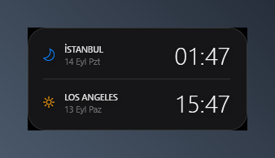
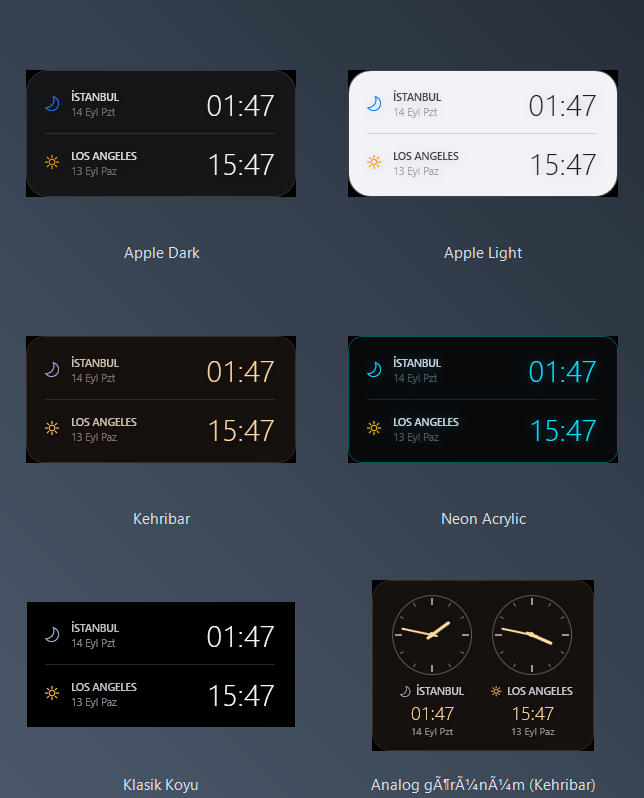
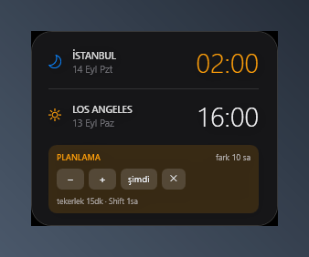

*[English documentation: README.md](README.md)*


# Desktop Dual Clock — iki şehir, tek masaüstü saati

Masaüstünde sürekli duran, şeffaf, dijital çift-saat widget'ı.
Kurulum gerektirmez: Windows PowerShell 5.1 + WPF (Windows'ta zaten var).



## Dosyalar

| Dosya | Görevi |
|---|---|
| `saat.ps1` | Widget'ın kendisi (WPF penceresi + zaman motoru) |
| `kur-baslangic.ps1` | **Dual Clock** kısayollarını kurar (Başlangıç + Başlat menüsü, `-Masaustune` ile masaüstü) |
| `dual-clock.ico` | Kısayol ikonu |
| `kaldir-baslangic.ps1` | Kısayolları kaldırır |

## Kullanım

**Elle başlatmak:** Başlat'a **"Dual Clock"** yazın. (Saati sağ tık →
*Kapat* ile kapattıysanız da yolu bu.)

> **Önceki sürümden geliyorsanız:** kısayollar eskiden *Masaustu Saat* adıyla
> kuruluyordu. Kurulum, kaldırma ve sağ tık → *Windows açılışında başlat*
> seçeneği eski adlı kısayolu da siliyor; böylece Başlangıç klasöründe saati
> açan iki kısayol birden kalmıyor.

`kur-baslangic.ps1` **iki** kısayol kurar — biri Başlangıç klasöründe açılışta
çalışsın diye, biri Başlat menüsünde elle açmak için; `-Masaustune` ile
üçüncüsü masaüstüne. İkisi de `powershell.exe`'yi doğrudan çağırmak yerine
`conhost.exe` üzerinden gider: varsayılan konsol barındırıcısı Windows Terminal
olduğunda `-WindowStyle Hidden` işe yaramıyor ve arkada boş bir terminal açık
kalıyor.

Açılışta otomatik başlamayı sonradan widget'ın kendisinden de aç/kapat
yapabilirsiniz: sağ tık → **Windows açılışında başlat**. Menüdeki tik, ayrı bir
ayar bayrağından değil **Başlangıç klasöründeki kısayolun gerçekten var olup
olmadığından** okunuyor; böylece `kur-baslangic.ps1` / `kaldir-baslangic.ps1`'i
elle çalıştırsanız bile tik gerçeği gösterir.

Saat aynı anda **tek kopya** çalışır; ikinci kez açarsanız sessizce çıkar.
Yoksa iki kopya `ayarlar.json`'a birlikte yazıp konum ve şehir seçimlerini
birbirine karıştırıyordu.

**Açılışta otomatik başlatmak:**

```bash
powershell -ExecutionPolicy Bypass -File kur-baslangic.ps1
```

**Kaldırmak:**

```bash
powershell -ExecutionPolicy Bypass -File kaldir-baslangic.ps1
```

Bu yalnızca `%APPDATA%\Microsoft\Windows\Start Menu\Programs\Startup` altına bir
kısayol koyar — kayıt defterine veya sistem ayarlarına dokunmaz. Kısayol
doğrudan `powershell.exe -WindowStyle Hidden` çağırır; açılışta çok kısa bir
konsol parlaması görülebilir.

> **Neden `.vbs` başlatıcı yok?** Bazı kurumsal uç-nokta koruma yazılımları
> `.vbs` dosyası oluşturmayı engeller (`Permission denied`) — `powershell`'i
> gizli çağıran bir VBS klasik kötü amaçlı yazılım deseni olduğu için makul
> bir kural.
> Konsol parlaması rahatsız ederse alternatif, aynı komutu oturum açma
> tetikleyicili bir Görev Zamanlayıcı görevine taşımaktır.

## Şehir seçimi

Sağ tık → **Şehir seç** → *Üst satır* / *Alt satır* → 25 şehir arasından seçin.
Varsayılan İstanbul + Los Angeles.

Liste UTC ofsetine göre sıralı (batıdan doğuya): Los Angeles, Denver, Chicago,
New York, Toronto, São Paulo, UTC, Londra, Paris, Madrid, Milano, Berlin,
Kahire, İstanbul, Moskova, Doha, Riyad, Dubai, Bakü, Taşkent, Delhi, Singapur,
Şanghay, Tokyo, Sidney. Menüde şehir aramak yerine "kabaca nerede" diye
bakmak daha hızlı olsun diye alfabetik değil coğrafi sırada.

Seçim `%APPDATA%\MasaustuSaat\ayarlar.json` içinde `sehirUst` / `sehirAlt`
olarak saklanır. Her şehirde Windows saat dilimi kimliği + IANA yedeği var;
yaz saati geçişleri her şehir için kendi kurallarıyla işler.

> Planlama modundayken şehir değiştirirseniz plan zamanı "şimdi"ye sıfırlanır —
> ayarlanan saat artık başka bir dilime ait olacağı için anlamı kayardı.

## Görsel Şablonlar (Temalar)

Sağ tık → **Şablon** menüsünden 6 farklı stil arasında geçiş yapabilirsiniz:

- 🌗 **Apple Otomatik (sistemi izler):** Windows'un açık/koyu tema ayarına bakar ve
  Apple Açık ile Apple Koyu arasında kendiliğinden geçer. Ayarı siz Windows
  tarafında değiştirdiğiniz anda widget da değişir — yeniden başlatmak gerekmez.
- 🍏 **Apple Koyu (macOS):** 22px squircle kavisli köşeler, ince parlak frosted cam kenarlık (`#38FFFFFF`), yarı saydam koyu akrilik zemin, yumuşak Apple gölgesi ve canlı sistem renkleri (amber güneş, mavi ay).
- ⚪ **Apple Açık:** Açık renk duvar kağıtları için buzlu açık cam zemin (`#D9F2F2F7`), ince mat çerçeve ve koyu antrasit tipografi.
- 🟠 **Kehribar:** Sıcak koyu tema — kahve-siyah zemin (`#D91A1410`), kehribar saat
  rakamları ve krem tipografi. Ay ikonu bilerek soğuk lavanta: gece/gündüz ayrımı
  ikon renginden de okunuyor.
- ⚡ **Neon Akrilik:** OLED derin siyah zemin (`#E608090C`), fütüristik elektrik camgöbeği (cyan) kenarlık ve neon ışıma gölgesi.
- 🌑 **Klasik Koyu:** Sade, kenarlıksız, minimalist orijinal koyu cam tasarım.



*Apple Otomatik* görselde yok çünkü kendine ait bir paleti yok: Windows'un
açık/koyu ayarını izleyip Apple Koyu ya da Apple Açık olarak çiziliyor.

Seçilen şablon `%APPDATA%\MasaustuSaat\ayarlar.json` içinde `sablon` olarak kalıcı
saklanır. Otomatik seçildiğinde dosyada `apple-auto` durur — hangi paletin
kullanılacağı her açılışta (ve her sistem teması değişiminde) yeniden çözülür.

## Görünüm (dijital / analog)

Sağ tık → **Görünüm** ile yerleşim değişir. Bu, şablondan **bağımsız** bir
ayardır: analog kadran hangi şablon seçiliyse onun renklerini kullanır.

- **Dijital:** İki satır, büyük saat rakamları (varsayılan).
- **Analog kadran:** İki kadran yan yana; altlarında şehir adı, dijital saat ve
  tarih. Kadranda 12 çentik (12/3/6/9 daha belirgin), akrep ve yelkovan var —
  saniye ibresi bilerek yok.

Planlama modunda **üst kadranın ibreleri vurgu rengine geçer** — ayarlanan
kadran o, alt kadran sonucu gösterir.

Seçim `ayarlar.json` içinde `gorunum` olarak (`dijital` / `analog`) saklanır.

## Planlama modu

Toplantı ayarlarken kullanılır: bir şehirde saati belirlersiniz, diğerinin
karşılığı anında görünür.

**Açmak:** sağ tık → *Planlama modu*

```
🌙 İSTANBUL       13:00   ← ayarladığınız satır (vurgulu)
   20 Ağu Per
☀ LOS ANGELES     03:00   ← sonuç
   20 Ağu Per
┌ PLANLAMA                    fark 10 sa
│ [−] [+] [şimdi] [✕]
└ tekerlek 15dk · Shift 1sa
```

| Kontrol | Ne yapar |
|---|---|
| `−` / `+` | 15 dakika geri / ileri |
| Fare tekerleği | 15 dk — **Shift** ile 1 saat |
| `şimdi` | Şu anı alır, sonraki 15 dakikaya yuvarlar |
| `✕` | Canlı saate döner |



**Ayarladığınız satır her zaman üsttekidir** ve vurgulu yanar; alttaki sonucu
gösterir. Diğer şehrin saatine göre planlamak isterseniz *Şehir seç* ile iki
satırın şehrini yer değiştirin. Her iki şehrin tarihi ayrı gösterildiği için
gün kayması (LA'da bir önceki gün) doğrudan okunur.

> **Mod kalıcı değildir** — her başlangıçta canlı saatten başlar. Açılışta
> donmuş bir saat görüp "widget bozulmuş" sanmayasınız diye böyle.

> Fare tekerleği, Windows'un "üzerine gelince etkin olmayan pencereleri kaydır"
> ayarı kapalıysa çalışmayabilir; `−` / `+` butonları her hâlükârda çalışır.

**Neden klavyeyle saat yazılamıyor?** Widget masaüstü seviyesinde durabilmek
için `WS_EX_NOACTIVATE` ile çalışıyor — yani hiçbir zaman klavye odağı almıyor.
Odak alsaydı tıkladığınızda öne fırlar ve çalışmanızın önünü keserdi. Bu yüzden
tüm kontroller fare tabanlı.

## Etkileşim

- **Sürükle:** sol tuşla tut ve taşı; bırakınca konum kaydedilir.
- **Sağ tık:**
  - **Şablon:** Apple Otomatik (sistemi izler), Apple Koyu (macOS), Apple Açık,
    Kehribar, Neon Akrilik, Klasik Koyu
  - **Görünüm:** Dijital / Analog kadran
  - **Arka plan:** Yok (tam şeffaf) / Hafif / Koyu
  - **Planlama modu:** Saat dönüştürücü şeridini açar/kapatır
  - **Şehir seç:** Üst ve alt satır için 25 şehir
  - **Windows açılışında başlat:** Başlangıç klasöründeki kısayolu açar/kapatır
  - **Konumu sıfırla:** Sağ üst köşeye döndürür
  - **Kapat:** Uygulamadan çıkar

Ayarlar: `%APPDATA%\MasaustuSaat\ayarlar.json`

## Tasarım kararları

**Zaman dilimi.** Sabit ofset (UTC−8 / UTC+3) **kullanılmıyor**; `TimeZoneInfo`
ile Windows'un tz veritabanı okunuyor. ABD yaz saati uygulaması Mart–Kasım
arasında değişirken Türkiye 2016'dan beri kalıcı UTC+3'te. Sabit ofset yazılsaydı
yılda ~3 hafta boyunca saat yanlış gösterirdi. DST geçişlerinde iki şehir arası
fark 10 ↔ 11 saat arasında kendiliğinden değişir.

**Plan zamanı bir AN olarak tutuluyor (UTC), bir şehrin duvar saati olarak
değil.** Kulağa ayrıntı gibi geliyor ama planlama modunun doğruluğu buna
bağlı: duvar saati ile an arasında birebir eşleme yoktur — ileri alma
gecesinde bir saat hiç yaşanmaz, geri alma gecesinde bir saat iki kez yaşanır.
Önceki sürüm üst şehrin duvar saatini adımlıyordu ve geçiş saatinde `+15 dk`
basmak karşı şehrin saatini **45 dakika geri** götürebiliyordu; fark da o bir
saat boyunca bir saat yanlış okunuyordu. An'ı UTC olarak adımlayınca iki satır
da tam olarak adım kadar ilerliyor.

Görünen sonuç şaşırtıcı değil, doğru: üstte Londra varken ileri alma gecesinde
adımlarsanız 00:45 → 02:00 okursunuz, çünkü o gece 01:00 gerçekten yoktur.
Geri alma gecesinde alttaki şehir tekrar eden saati iki kez gösterir —
o şehrin saatleri gerçekten böyle yapar — ve fark tam doğru anda değişir.

**Görünüm, şablondan ayrı bir eksen.** Şablon renk paletini, görünüm
yerleşimi belirliyor — analog kadran hangi şablon seçiliyse onun renklerini
kullanıyor. Bunları tek listede birleştirmek ("Kehribar Analog" gibi bir
şablon) altı şablon × iki yerleşim = on iki giriş demekti; her renk
değişikliğini iki yerde yapmak gerekirdi.

Kadranın çentikleri ve ibreleri XAML'de değil kodda üretiliyor (`New-Kadran`):
12 çentik × 2 kadran elle yazılacak 24 satır eder, ve ibrelerin dönüş merkezi
zaten kadran boyutundan hesaplanıyor. İbreler 12 yönünde çizilip
`RotateTransform` ile döndürülüyor; güncellemede tek bir `Angle` ataması
yetiyor, geometri yeniden hesaplanmıyor.

**Saniye ibresi yok.** Kadran dakikada bir güncelleniyor; masaüstünde sürekli
duran bir widget için saniyede bir yeniden çizim boşa giden iş. `Update-Saat`
aynı dakika içinde çağrıldığında hemen çıkıyor.

**Masaüstü seviyesi.** Klasik yöntem pencereyi `SetParent` ile Progman'ın
(masaüstü penceresi) çocuğu yapmaktır. WPF'te bu iki sorun çıkardı: koordinatlar
ebeveyne göreli hâle gelip çok monitörlü kurulumda pencere ekran dışına kaçtı
(Progman tüm sanal masaüstünü kapsar ve başlangıcı negatif olabilir), ve
`explorer.exe` ile aynı girdi kuyruğuna bağlanmak kilitlenme riski taşıyor.
Bunun yerine pencere normal üst düzey pencere olarak kalıyor ama:

- `WS_EX_NOACTIVATE` → tıklanınca öne gelmez, odağı çalmaz
- `WS_EX_TOOLWINDOW` → Alt+Tab ve görev çubuğunda görünmez
- `HWND_BOTTOM` → `WM_WINDOWPOSCHANGING` kancası ile z-sırasının dibinde tutulur

Sonuç kullanıcı açısından aynı: masaüstünde durur, hiçbir pencerenin önünü
kesmez. Win+D sonrası küçültülürse `StateChanged` olayıyla hemen geri açılır.
Periyodik yoklama yapılmadığı için masaüstü sağ tık menüsünü kapatmaz veya
simge seçimini bozmaz.

**Tuzaklar** (aynı hataya düşmemek için):

- `FindWindow('Progman', $null)` çalışmaz — PowerShell `$null`'ı boş string
  olarak marshal eder, arama "başlığı boş Progman"a döner. `GetShellWindow()`
  kullanın.
- `HWND_BOTTOM` = **1**, 8 değil.
- `.ps1` dosyaları UTF-8 **BOM ile** kaydedilmeli; Windows PowerShell 5.1
  BOM'suz UTF-8'i ANSI sanıp Türkçe karakterleri bozar.

## Tanı

Sorun çıkarsa tanı günlüğü açılabilir:

```bash
set SAAT_TANI=1 && powershell -NoProfile -ExecutionPolicy Bypass -STA -File saat.ps1
```

Ek bayraklar: `SAAT_PLAN=1` planlama modu açık başlatır,
`SAAT_OTOTEST=1` buton olay bağlantılarını sınayıp sonucu günlüğe yazar
(dışarıdan fareyle test etmeyin — widget z-sırasının dibinde olduğu için
tıklama üstteki pencereye gider).

Günlük: `%TEMP%\masaustu-saat-tani.log`

## Şekillendirilebilir nokta: `Get-GunDurumu`

`saat.ps1` içindeki bu fonksiyon bir şehrin gündüz mü gece mi olduğuna karar
verip ikonu ve rengini döndürür. Şu an en basit hâli — 07:00–18:59 arası gündüz:

```powershell
function Get-GunDurumu {
    param([datetime]$Yerel)
    if ($Yerel.Hour -ge 7 -and $Yerel.Hour -lt 19) {
        return [pscustomobject]@{ Ikon = $IkonGunes; Renk = '#FFC24B' }
    }
    return [pscustomobject]@{ Ikon = $IkonAy; Renk = '#9FB6D9' }
}
```

Değiştirmeye değer, çünkü asıl soru "güneş doğmuş mu" değil, muhtemelen
**"şu an arasam uygun olur mu"**. Birkaç yön:

- **Üç durum:** mesai içi (yeşil/amber) / uyanık ama mesai dışı (soluk) / gece
  (mavi). Karşı tarafın müsaitliğini tek bakışta verir.
- **Hafta sonu ayrımı:** `$Yerel.DayOfWeek` ile Cumartesi/Pazar'ı mesai dışı say.
- **Sabit saat yerine mevsimsel:** yaz/kış gün uzunluğu farkını yansıtmak
  isterseniz aya göre eşik kaydırın (Ağustos'ta 06:00 aydınlık, Ocak'ta değil).

`$IkonGunes` / `$IkonAy` yerine başka Segoe MDL2 Assets glifleri de
kullanabilirsiniz (ör. `0xE9CA` iş, `0xE7E8` kahve).

## Arayüz dili

Arayüz **Windows görüntü diline göre** otomatik seçilir: Türkçe sistemde Türkçe,
diğerlerinde İngilizce. Ayar yok. Yalnızca `tr` ve `en` var; yeni bir dil
eklemek metin tablosuna bir satır eklemek demek.
